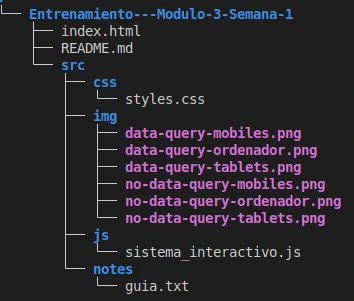
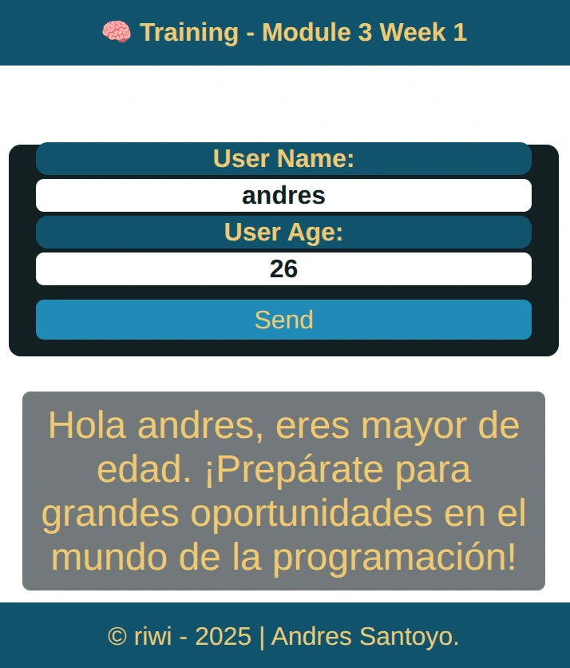
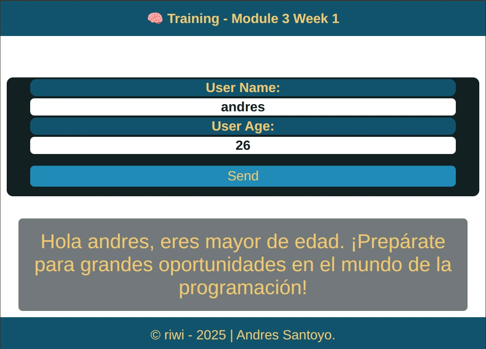
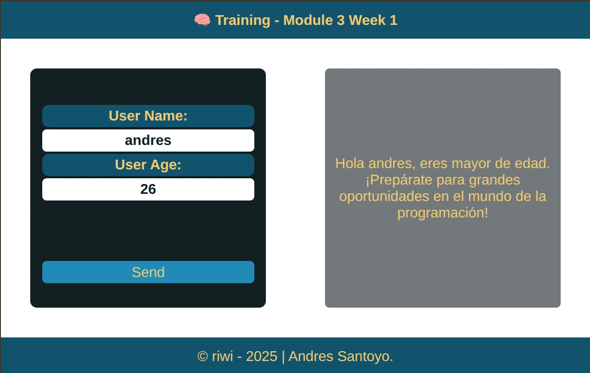

# Training - Module 3 Week 1

This project consists of a small web application that receives the name and age of the user, and depending on the age it displays a personalized message. It was developed as part of module 3 of the web programming training of **Riwi**.

## Technologies used

- HTML5  
- CSS3  
- JavaScript

## Project Structure

## Description of operation

The project has a form that asks for two pieces of information:

- User name
- User age

Clicking the "Send" button executes a JavaScript function that:

1. Avoid traditional form submission (`e.preventDefault()`).

2. Takes the values entereds in the name and age fields.

3. Evaluate the age entered:
    - If they are under 18, a motivational message for minors is displayed. 
    - If it is greater than or equal to 18, an adult message is displayed. 
    - If there is an error in the age (e.g. empty or invalid field), an alert 
    message is displayed.
    - If age entered is a negative number send a message error.

The message is dynamically displayed inside a < span > with the ID 'response'.

## How to run the program
To run the program, it is necessary to have previously installed a web browser, such as chrome, moxila, brave, etc...

**se debe ingresar al archivo index.html e interactuar con el formulario de la pagina.**

##  responsive web desing
1. media query for mobiles

    

2. media query for tablets

    

3. media query for computers

    

##  Autor

**Andres Santoyo**
© riwi - 2025

